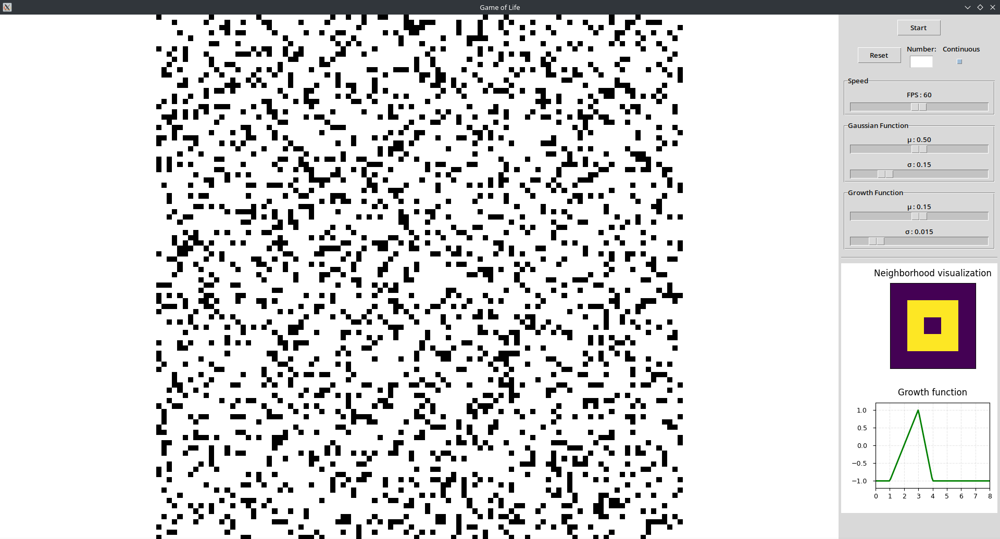

# Welcome to the Game of Life Documentation

This documentation covers the implementation of a cellular automata simulator including:

- **Conway's Game of Life**: classic discrete cellular automaton
- **Lenia**: continuous variant of cellular automata

## Overview

This project implements a graphical application for visualizing and interacting with different types of cellular automata. The user interface allows switching between discrete mode (Game of Life) and continuous mode (Lenia), and provides controls to adjust simulation parameters.

## Project Structure

The project is organized according to the MVC (Model-View-Controller) pattern and divided into several modules:

- **fi**: Influence Functions module (neighborhood and growth functions)
- **sim**: Simulation module (grid management and temporal evolution)
- **us**: User Interface module (controls and parameters)
- **wm**: Window Manager module (layout and display)

## Installation

Pour installer l'outil:

```bash
source setup.sh
```

## Running the Application

```bash
python src/main.py
```

## Screenshots



## Documentation Navigation

- Check the **Architecture** section to understand the project design
- Explore the API documentation in the **Modules** section
- Refer to the **User Guide** for information on how to use the application 