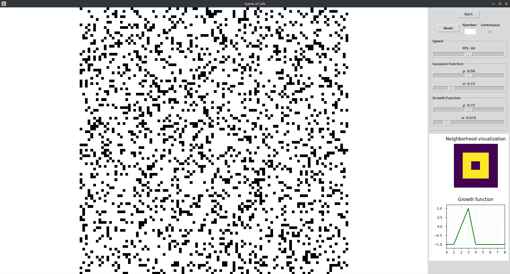

# User Guide

Welcome to the Game of Life simulator! This guide will help you understand how to use the application and get the most out of its features.

## Getting Started

### Main Interface

The interface is divided into three main sections:

1. **Control Panel** (left): Contains simulation controls and parameter settings
2. **Simulation Grid** (center): Displays the cellular automaton
3. **Function Visualizations** (right): Shows neighborhood and growth functions

## Simulation Controls

### Basic Controls

- **Start/Stop Button**: Toggle the simulation between running and paused states
- **Step Button**: Advance the simulation by one step (only when paused)
- **Reset Button**: Reset the simulation to its initial state
- **Mode Switch**: Toggle between discrete (Game of Life) and continuous (Lenia) modes
- **Randomize Button**: Fill the grid with random cell states

### Speed Control

Use the speed slider to adjust how fast the simulation runs. Higher values make the simulation update more frequently.

## Simulation Modes

### Discrete Mode (Conway's Game of Life)

In discrete mode, each cell is either alive (1) or dead (0), and the rules are:

1. Any live cell with fewer than 2 live neighbors dies (underpopulation)
2. Any live cell with 2 or 3 live neighbors survives
3. Any live cell with more than 3 live neighbors dies (overpopulation)
4. Any dead cell with exactly 3 live neighbors becomes alive (reproduction)

### Continuous Mode (Lenia)

In continuous mode, each cell has a value between 0 and 1, and the rules are based on:

1. A neighborhood kernel (defining how cells interact with their neighbors)
2. A growth function (determining how a cell's state changes based on its neighborhood)

You can modify these rules using:
- **Neighborhood Parameters**: Control the shape of the neighborhood kernel
- **Growth Parameters**: Control the response of cells to their neighborhoods

## Troubleshooting

### Common Issues

- **Simulation too slow**: Reduce the grid size or increase your computer's performance
- **Patterns behaving unexpectedly**: Check if you're in the correct mode (discrete/continuous)
- **Application crashes**: Make sure you have all the required dependencies installed

### Getting Help

If you encounter any issues or have questions:
- Check the [GitHub issues](https://github.com/BaptistePignier/CAS741-GameOfLife/issues)
- Submit a new issue with details about your problem